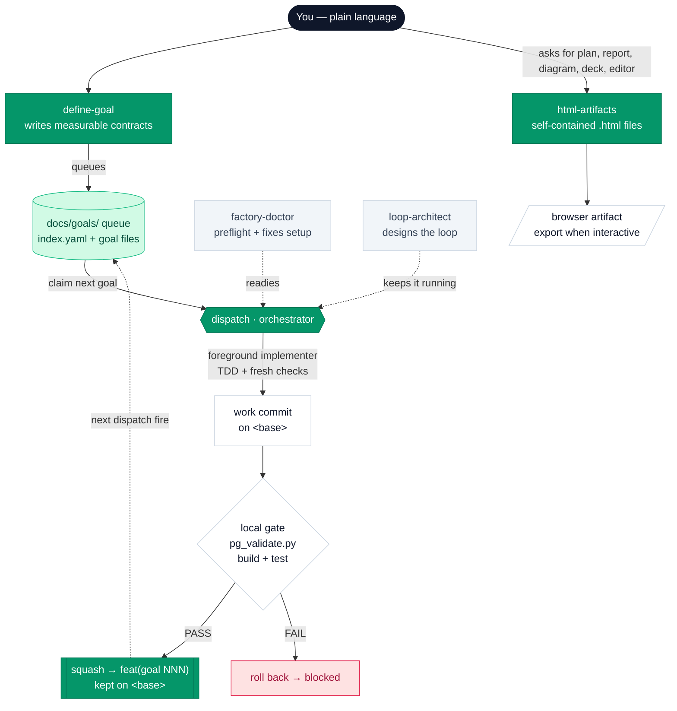

# flywheel

**Turn plain-language wants into autonomous execution.**
A skills-only plugin marketplace for [Claude Code](https://claude.com/claude-code)
and [Droid](https://factory.ai) (Factory CLI), from Pragmatic Growth.

[](https://plugin.pragmaticgrowth.com)
[](CHANGELOG.md)
[](#works-in-both-clis)
[](LICENSE)

> 🌐 **Full docs:** **<https://plugin.pragmaticgrowth.com>**

---

## What is this?

flywheel gives you a small, focused toolkit for **describing what you want in
plain English and having agents actually build it** — with the guardrails that
keep an unattended agent loop from going off the rails.

You say *“I want the pricing page to load in under 1.2 seconds.”* The plugin
investigates your codebase, turns that into a **measurable contract** (what
“done” means, how to verify it), drops it into a **queue that lives in your
repo**, and then — when you’re ready — works that queue **one goal per run**:
a foreground implementer commits directly on your current branch using TDD and
a lightweight subagent review loop (independent read-only lenses), the orchestrator runs a local
build + test gate, and only work that passes is kept (failures roll back).

It is **skills-only**: no MCP servers, no slash commands of its own, no hooks,
no background daemons, no build step. The marketplace now exposes three plugins:
`flywheel` with four workflow
[skills](https://docs.claude.com/en/docs/claude-code/skills),
`html-artifacts` as a separate rich-deliverables plugin, and
`autoresearch` for autonomous optimization loops.

### Why a queue in the repo instead of GitHub issues?

Because issues have body-size limits, need per-repo label bootstrapping, and
drift away from the code. flywheel keeps goals as plain Markdown files
**versioned alongside your code** in `docs/goals/`. The queue is just the to-do
list, and it travels with the repo; verified commits land directly on your
branch through the local gate. (You can still open a PR yourself whenever you
want a review surface — flywheel just doesn't require one.)

---

## Marketplace plugins

| Plugin | What it contains | Install |
|---|---|---|
| **flywheel** | `define-goal`, `dispatch`, `loop-architect`, and `factory-doctor` for the docs/goals execution pipeline. | `/plugin install flywheel@pragmatic-growth` |
| **html-artifacts** | One `html-artifacts` skill with references for self-contained browser deliverables. | `/plugin install html-artifacts@pragmatic-growth` |
| **autoresearch** | One `autoresearch` skill (+ a Python helper) for an autonomous try/measure/keep/revert optimization loop. | `/plugin install autoresearch@pragmatic-growth` |

## The workflow skills

| Skill | One line | Invoke with |
|---|---|---|
| **define-goal** | Plain-language want → a measurable goal contract (or a whole document of them). Never writes code. | `/define-goal …` · or just say *“I want…”* |
| **dispatch** | The factory orchestrator: works one ready goal per run — claim, implement with TDD + fresh checks, local gate, keep or roll back. | `/dispatch` · *”work goal 005”* |
| **loop-architect** | Designs the *loop contract* (prompt + verification + stop conditions) for autonomous, scheduled, or remote runs. | *“keep working on X”* · setting up a `/loop`, routine, or cron |
| **factory-doctor** | One-pass preflight/doctor for the repo + machine. Auto-fixes everything local; reports the rest with exact fixes. | `/factory-doctor` |

In Claude Code the workflow skills are namespaced — `flywheel:define-goal`,
etc. `html-artifacts` installs as its own plugin and exposes
`html-artifacts:html-artifacts`. Skills also activate **automatically** when
your message matches what they’re for, so most of the time you don’t type the
name at all.

### define-goal — capture wants as contracts

The front door. Give it a sentence, a paragraph, or a whole bug-report
document, and it produces **goal contracts** — never implementation.

- **Recon first, by default.** Before writing a single success criterion, it
  sends parallel read-only agents to investigate the actual system (your repo,
  a separate service, a database — wherever it lives). Those agents inherit the
  current model; flywheel does not force Sonnet for recon. “The description
  sounded clear” is the failure mode this replaces.
- **Brief first, then a real artifact.** If outcome, environment, validator,
  scope, or risk is missing, it asks one concise question round, then finishes
  with either a run-now command or a queued goal file — not open-ended advice.
- **Two destinations.** It can hand you a copy-pasteable **run-now** line
  (`/goal …` in Claude Code, `droid exec --auto high "…"` in Droid), or **queue**
  a goal file (`docs/goals/NNN-slug.md` + an `index.yaml` entry) to be worked
  later by dispatch.
- **Grounded in your repo.** It copies your `CLAUDE.md` / `AGENTS.md` rules
  verbatim into the contract, fills in *real* verification commands, and
  auto-populates the goal’s `touches:` / `acceptance:` fields from recon.
- **Batch mode.** Hand it a list (feedback doc, meeting notes, a backlog) and
  it drafts every goal, then gates the file writes behind an approval table.

```text
> I want signups to send a welcome email within 30 seconds
  define-goal ▸ recon (3 read-only agents) ▸ contract
  ✓ queued  docs/goals/021-welcome-email.md   type: feature
```

### html-artifacts plugin — make rich deliverables readable

The browser-file sidecar lives as a separate plugin in the same marketplace. Use
it for work that markdown flattens: implementation plans, specs, PR reviews,
codebase tours, diagrams, research explainers, status reports, decks,
prototypes, and custom editors.

- **One skill, many references.** The skill has a small trigger/routing front
  door, then loads category references only when needed: planning,
  code-review, design/prototypes, diagrams/data, research/reports, editors,
  decks, and source coverage.
- **Self-contained files.** It writes real `.html` artifacts with inline CSS
  and JavaScript — no server, no listener, no build step, no new plugin
  surface.
- **Round-trip editors.** If the user manipulates state (triage, tuning,
  annotation, selection), the artifact includes an export/copy button that
  returns JSON, markdown, CSV, or prompt text back to the agent.
- **Default only when it helps.** Short chat answers, code-only snippets, and
  command sequences stay in markdown.

### dispatch — work the queue

The orchestrator. It works **one ready goal per run** on the currently
checked-out branch — no PRs, no worktrees, no parallel implementers. Use
`/loop /dispatch` (Claude Code) or a same-session Droid cron to repeat that
cycle until the queue is drained.

Per goal:

1. **Claim** the next `not_started` goal (flip one entry → commit on the
   current branch).
2. **Implement** — a foreground implementer commits work directly on `<base>`,
   using a short plan/checklist, TDD for code changes, and a fresh multi-lens
   review (a small panel of independent read-only lenses) for non-trivial work.
3. **Local gate** — the dispatch orchestrator runs the repo’s `config.verify`
   commands (build + tests), and `pg_validate.py` runs the per-goal acceptance +
   structural checks on the `gate_base..HEAD` diff.  
   - **PASS** → the implementer’s commits are squashed into one
     `feat(goal NNN)` commit kept on the branch.  
   - **FAIL** → work is rolled back; the goal is marked `blocked`.
4. **Stop** after this goal. A later `/dispatch` run picks up the next ready
   goal; `/loop /dispatch` repeats automatically.

CI, if present, is a post-push observation — not a gate. You can also target a
single goal in an interactive session: *”work goal 005.”*

### loop-architect — make it run itself, safely

Automating work is easy to get wrong: a naive “keep doing X” loop never knows
when it’s finished and can burn for hours. loop-architect designs the **loop
contract** instead — the prompt, the verification step, and the **stop
conditions** — and maps the right primitives for your CLI (`/loop` vs
`CronCreate`, `/goal` vs `droid exec`). Use it whenever you want something to
run unattended, on a schedule, or remotely. If the cadence, gate, budget, or
stop condition is unclear, it asks a short calibration round before writing the
copy-pasteable setup.

### factory-doctor — get the environment ready

Run this **before your first `/dispatch`**, or any time the factory behaves
like the environment isn’t ready. It checks software, `gh` auth + scopes, the
local gate (`config.verify` present and runnable), a clean working tree, the
working branch, CI, and the queue itself — **auto-fixing everything local**
(scaffolding the queue, stripping deprecated v3 config keys —
`merge`/`wip`/`execution`/`autonomy` — from a stale `index.yaml`, and checking
both `.claude/` and `.factory/` settings) and
reporting remote/CI issues with the exact fix. It diagnoses and fixes setup; it
never implements goals.

### autoresearch plugin — optimize by experiment

A separate plugin in the same marketplace for a different job: **autonomously
optimizing a measurable metric**. Point it at a benchmark (training loss, test
runtime, bundle size, build time…) and it runs a disciplined loop — try one
hypothesis, measure, keep the change if it improves and revert it if it doesn't,
then repeat — with **MAD-based confidence scoring** to tell a real gain from
noise.

- **Isolated and resumable.** Work happens on an `autoresearch/<goal>-<date>`
  branch; all state lives in files (`autoresearch.md`, `autoresearch.sh`,
  `autoresearch.jsonl`) so a fresh session with no memory reads them and
  continues exactly where the last one stopped.
- **Runs unattended, both CLIs.** Let it loop in one session, or wrap the resume
  in `/loop` (Claude Code) or a same-session `CronCreate` (Droid).
- **Clean output.** On termination it groups the kept experiments into
  independently-mergeable branches for review — the raw experiment branch is
  always preserved. Adapted from Factory's `autoresearch` plugin (MIT).

---

## How it all fits together



The intended flow: **capture** wants with define-goal → **work** the queue with
dispatch → **keep it running** unattended with a loop designed by
loop-architect. html-artifacts handles rich browser deliverables along the way,
and factory-doctor makes sure the ground is solid first.

---

## The docs/goals queue

Goals live in the target repo, versioned with the code:

```
docs/goals/
├── index.yaml        # config + queue state — status lives ONLY here
├── 001-faster-checkout.md     # goal contract — content only, never status
├── 002-fix-auth-redirect.md
└── done/             # archived completed goal files
```

**Status lives only in `index.yaml`** (never in goal-file frontmatter —
dual-writing drifts). Goal files are immutable contracts. Statuses move
`not_started → in_progress → completed`, plus `blocked` (always with a reason,
so a blocked goal is surfaced for you rather than re-dispatched into a livelock).

A goal file is just readable Markdown with a little frontmatter:

```markdown
---
id: "001"
type: feature            # bug | feature | chore — shapes the contract
skills: [test-driven-development]
touches: [src/checkout/, src/cart/total.ts]
acceptance: "pnpm test checkout && pnpm playwright test checkout.spec"
---

# Faster checkout

## Success criteria
- [ ] Checkout route renders in < 1.2s (p95) on a cold cache
- [ ] All existing checkout tests stay green

## Out of scope
- Redesigning the cart UI
```

The `type:` shapes the contract: **bugs** must lead with a failing test that
reproduces the root cause; **features** must fill in *Out of scope*; **chores**
must prove no behavior change (suite green before and after).

### The claim protocol

Every status write is **flip one entry → commit** (`chore(goals):
claim|complete|block|archive <id>`) on the current branch — one entry per
commit. The single session owns the branch, so there is no push-arbitration;
push is an optional backup only. Implementer agents work directly on `<base>`
and **never touch `docs/goals/` at all** — only the orchestrator does.

---

## Configuration

The `config:` block at the top of `index.yaml` is the repo owner’s control
panel. Everything has a sensible default — an unconfigured repo just works.

```yaml
config:
  base: main              # branch dispatch works on and commits to
  model: inherit          # inherit | sonnet | haiku (for spawned code agents)
  # --- optional ---
  skills: []              # skills every implementer must invoke
  verify:                 # ordered local build + test gate (run before keeping a commit)
    - pnpm build
    - pnpm test
  budget:                 # external "burnstop" for long unattended runs
    max_goals_per_session: 1
    max_iterations: 200
```

| Key | Default | What it does |
|---|---|---|
| `base` | repo default branch | The branch dispatch works on — implementers commit here directly. Per-goal `base:` override allowed. |
| `model` | `inherit` | Model for spawned **code** agents (`inherit`/`sonnet`/`haiku`). The depth-vs-quota trade. Recon subagents inherit the current session/runtime model. |
| `skills` | — | Repo-wide skills every implementer must use (e.g. your TDD or review skills). |
| `verify` | — | Ordered list of local build + test commands. Run by the dispatch orchestrator after each implementation; PASS keeps the squash commit, FAIL rolls it back. |
| `budget` | none | `max_goals_per_session` / `max_iterations` ceilings the loop can’t exceed — the external brake on a long run. Dispatch itself works one goal per run. |

---

## Install

**Claude Code:**

```bash
/plugin marketplace add pragmaticgrowth/flywheel
/plugin install flywheel@pragmatic-growth
/plugin install html-artifacts@pragmatic-growth
/plugin install autoresearch@pragmatic-growth
```

**Droid (Factory CLI):**

```bash
droid plugin marketplace add https://github.com/pragmaticgrowth/flywheel
droid plugin marketplace list   # confirms the marketplace name is flywheel
droid plugin install flywheel@flywheel
droid plugin install html-artifacts@flywheel
droid plugin install autoresearch@flywheel
```

Pull updates later with `/plugin marketplace update pragmatic-growth` (Claude
Code) or `droid plugin marketplace update flywheel` (Droid), then update any
installed plugin from the Installed tab or with the CLI's plugin update command.

### Quick start

```bash
/factory-doctor                              # 1. make sure the repo + machine are ready
/define-goal I want the API p95 latency under 200ms   # 2. capture a want → queued contract
/dispatch                                    # 3. work one ready goal
```

Droid headless equivalent for the first preflight:

```bash
droid exec --auto high "Run flywheel factory-doctor for this repo, apply safe local fixes, and report needs-you"
```

That’s the whole arc: preflight, capture, work. Add more goals any time —
define-goal appends to the queue, and `/dispatch` (or `/loop /dispatch`) picks
them up. Set `config.budget` in `index.yaml` before long unattended runs.

---

## The local gate

After each implementation, the dispatch orchestrator runs the repo’s
`config.verify` commands (build + tests), and `pg_validate.py` runs the
per-goal acceptance + structural checks on the local `gate_base..HEAD` diff:

- All `verify` commands must exit 0.
- A secret / forbidden-content scan.

It emits a verdict — **PASS** or **FAIL** — and the orchestrator acts on it:
PASS squashes the implementer’s commits into one `feat(goal NNN)` commit kept
on the branch; FAIL rolls the work back and marks the goal `blocked`. CI,
if configured, runs after the push as a non-blocking observation.

---

## Running it autonomously

`/dispatch` works one ready goal and stops. Each run reports **progress-first**:
`6/8 done ████████████████░░░░ · ready 0 · blocked 2`.

If you want the queue to keep moving without re-running manually, `/loop
/dispatch` keeps firing the same one-goal cycle. Use `config.budget` as the
burnstop — an external ceiling the loop **cannot edit itself**, so a flaky queue
can’t burn indefinitely. When the budget is hit (or the queue drains), dispatch
stops and surfaces the reason. Let **loop-architect** design the loop contract
(verification + stop conditions) rather than firing a bare prompt.

---

## Works in both CLIs

Three plugins, two runtimes. Droid auto-translates the `.claude-plugin/` manifest
format, and the skills **detect the runtime** and use the right paths,
commands, and scheduling primitives (`/goal` vs `droid exec`, `/loop` vs
`CronCreate`, `.claude/` vs `.factory/` settings). Everything above works the
same way in each; only the exact command surface differs, and the skills handle
that for you.

---

## Versioning & changelog

- **[CHANGELOG.md](CHANGELOG.md)** — the canonical, human-readable history of
  every release, each entry linked to its commit.
- **Git tags** — every release is tagged `vX.Y.Z` on its commit, so the version
  history is browsable on GitHub.
- **The site** — <https://plugin.pragmaticgrowth.com> hosts the full docs and
  install (canonical version history lives in CHANGELOG.md and GitHub Releases).

The `flywheel` plugin version lives in `.claude-plugin/plugin.json`; the
`html-artifacts` plugin version lives in
`plugins/html-artifacts/.claude-plugin/plugin.json`. The public site is
regenerated and redeployed on each release (see `CLAUDE.md` →
*Public site & changelog*).

---

## Project layout

```
flywheel/
├── .claude-plugin/
│   ├── plugin.json        # flywheel plugin manifest
│   └── marketplace.json   # the pragmatic-growth marketplace, listing all three plugins
├── skills/
│   ├── define-goal/SKILL.md
│   ├── dispatch/
│   │   ├── SKILL.md
│   │   └── scripts/
│   │       └── pg_validate.py         # local gate: per-goal acceptance + structural checks, PASS/FAIL verdict
│   ├── factory-doctor/
│   │   ├── SKILL.md
│   │   └── scripts/doctor_checks.py   # read-only readiness probe
│   └── loop-architect/SKILL.md
├── plugins/
│   ├── html-artifacts/
│   │   ├── .claude-plugin/plugin.json
│   │   └── skills/html-artifacts/
│   │       ├── SKILL.md
│   │       └── references/            # HTML artifact recipes and foundation rules
│   └── autoresearch/
│       ├── .claude-plugin/plugin.json
│       └── skills/autoresearch/
│           ├── SKILL.md
│           └── scripts/autoresearch_helper.py  # stdlib JSONL + MAD-confidence helper
├── public/                # the plugin.pragmaticgrowth.com site (index.html + brand SVGs)
├── wrangler.jsonc         # Cloudflare deploy config for the site
├── CHANGELOG.md           # canonical version history
└── CLAUDE.md / AGENTS.md  # contributor guide (AGENTS.md is a symlink — one source)
```

---

## Contributing & maintenance

This repo is the single source of truth — all three plugins install from the
`pragmatic-growth` marketplace and refresh from GitHub. If you’re editing
skills, read **[CLAUDE.md](CLAUDE.md)**: it documents the queue design
invariants, the release flow (bump `plugin.json` → update `CHANGELOG.md` + the
site → tag → push → refresh), and the rule that skills stay portable (no
user-specific absolute paths). New or changed skill mechanics get a subagent
dry-run before shipping.

---

## License

[MIT](LICENSE) © Pragmatic Growth
