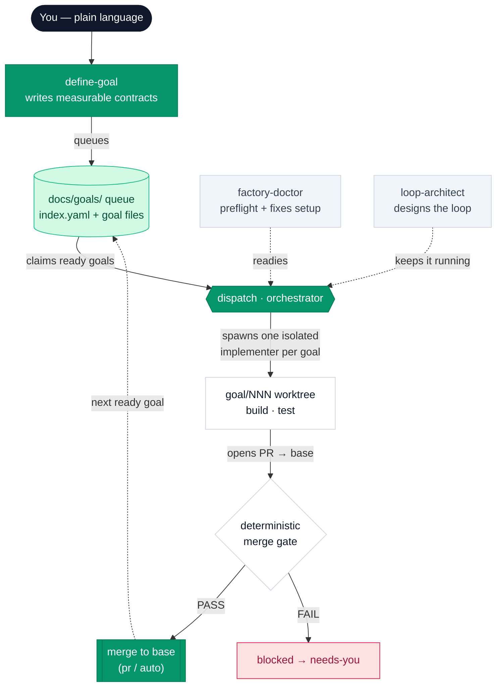

# flywheel

**Turn plain-language wants into autonomous execution.**
A skills-only plugin for [Claude Code](https://claude.com/claude-code) and
[Droid](https://factory.ai) (Factory CLI), from Pragmatic Growth.

[](https://plugin.pragmaticgrowth.com)
[](CHANGELOG.md)
[](#works-in-both-clis)
[](LICENSE)

> 🌐 **Full docs & changelog:** **<https://plugin.pragmaticgrowth.com>**

---

## What is this?

flywheel gives you a small, focused toolkit for **describing what you want in
plain English and having agents actually build it** — with the guardrails that
keep an unattended agent loop from going off the rails.

You say *“I want the pricing page to load in under 1.2 seconds.”* The plugin
investigates your codebase, turns that into a **measurable contract** (what
“done” means, how to verify it), drops it into a **queue that lives in your
repo**, and then — when you’re ready — works that queue with isolated agents
that open PRs, re-verify their own work, and (optionally) merge it back for you.

It is **skills-only**: no MCP servers, no slash commands of its own, no hooks,
no background daemons, no build step. Just four
[skills](https://docs.claude.com/en/docs/claude-code/skills) that Claude Code
and Droid load automatically and invoke when the conversation calls for them.

### Why a queue in the repo instead of GitHub issues?

Because issues have body-size limits, need per-repo label bootstrapping, and
drift away from the code. flywheel keeps goals as plain Markdown files
**versioned alongside your code** in `docs/goals/`. PRs stay the review and
merge surface; the queue is just the to-do list, and it travels with the repo.

---

## The four skills

| Skill | One line | Invoke with |
|---|---|---|
| **define-goal** | Plain-language want → a measurable goal contract (or a whole document of them). Never writes code. | `/define-goal …` · or just say *“I want…”* |
| **dispatch** | The factory orchestrator: claims goals, spawns one isolated implementer per goal, integrates verified merges. | `/dispatch` · `/loop 15m /dispatch` · *“work goal 005”* |
| **loop-architect** | Designs the *loop contract* (prompt + verification + stop conditions) for autonomous, scheduled, or remote runs. | *“keep working on X”* · setting up a `/loop`, routine, or cron |
| **factory-doctor** | One-pass preflight/doctor for the repo + machine. Auto-fixes everything local; reports the rest with exact fixes. | `/factory-doctor` |

In Claude Code these are namespaced — `flywheel:define-goal`, etc. They also
activate **automatically** when your message matches what they’re for, so most
of the time you don’t type the name at all.

### define-goal — capture wants as contracts

The front door. Give it a sentence, a paragraph, or a whole bug-report
document, and it produces **goal contracts** — never implementation.

- **Recon first, by default.** Before writing a single success criterion, it
  sends parallel read-only agents to investigate the actual system (your repo,
  a separate service, a database — wherever it lives). “The description sounded
  clear” is the failure mode this replaces.
- **Two destinations.** It can hand you a copy-pasteable **run-now** line
  (`/goal …` in Claude Code, `droid exec --auto high "…"` in Droid), or **queue**
  a goal file (`docs/goals/NNN-slug.md` + an `index.yaml` entry) to be worked
  later by dispatch.
- **Grounded in your repo.** It copies your `CLAUDE.md` / `AGENTS.md` rules
  verbatim into the contract, fills in *real* verification commands, and
  auto-populates the goal’s `touches:` / `acceptance:` fields from recon.
- **Batch mode.** Hand it a list (feedback doc, meeting notes, a backlog) and
  it drafts every goal, then gates the file writes behind an approval table.

```text
> I want signups to send a welcome email within 30 seconds
  define-goal ▸ recon (3 read-only agents) ▸ contract
  ✓ queued  docs/goals/021-welcome-email.md   type: feature
```

### dispatch — work the queue

The orchestrator. It never writes code in its own context — it **shepherds**.
Every time it runs, one idempotent iteration:

1. Pushes any in-flight factory PRs forward (review → ready).
2. Claims up to `wip` ready goals from the queue (claiming is a loop, so it
   fills capacity every iteration, not one goal per run).
3. Spawns **one isolated implementer agent per goal**, each in its own
   `goal/<id>` worktree branched fresh from `origin/<base>`.
4. Under `merge: auto`, runs a deterministic gate on a fresh checkout and
   integrates verified merges — one goal at a time.

It’s built to run on a timer — `/loop 15m /dispatch` (Claude Code) or a
`CronCreate` every 15 minutes (Droid) — and **parallel sessions are safe**
because every status write goes through the claim protocol. You can also run it
**solo** on one goal in an interactive session: *“work goal 005.”*

### loop-architect — make it run itself, safely

Automating work is easy to get wrong: a naive “keep doing X” loop never knows
when it’s finished and can burn for hours. loop-architect designs the **loop
contract** instead — the prompt, the verification step, and the **stop
conditions** — and maps the right primitives for your CLI (`/loop` vs
`CronCreate`, `/goal` vs `droid exec`). Use it whenever you want something to
run unattended, on a schedule, or remotely.

### factory-doctor — get the environment ready

Run this **before your first `/dispatch`**, or any time the factory behaves
like the environment isn’t ready. It checks software, `gh` auth + scopes, the
harness merge allow-rule, branch protection, CI, and the queue itself —
**auto-fixing everything local** (writing a *narrow* merge allow-rule, scaffolding
the queue, in both `.claude/` and `.factory/` settings) and reporting remote/CI
issues with the exact fix. It diagnoses and fixes setup; it never implements
goals or merges PRs.

---

## How it all fits together



The intended flow: **capture** wants with define-goal → **work** the queue with
dispatch → **keep it running** unattended with a loop designed by
loop-architect. factory-doctor makes sure the ground is solid first.

---

## The docs/goals queue

Goals live in the target repo, versioned with the code:

```
docs/goals/
├── index.yaml        # config + queue state — status lives ONLY here
├── 001-faster-checkout.md     # goal contract — content only, never status
├── 002-fix-auth-redirect.md
└── done/             # archived completed goal files
```

**Status lives only in `index.yaml`** (never in goal-file frontmatter —
dual-writing drifts). Goal files are immutable contracts. Statuses move
`not_started → in_progress → completed`, plus `blocked` (always with a reason,
so a blocked goal is surfaced for you rather than re-dispatched into a livelock).

A goal file is just readable Markdown with a little frontmatter:

```markdown
---
id: "001"
type: feature            # bug | feature | chore — shapes the contract
skills: [test-driven-development]
touches: [src/checkout/, src/cart/total.ts]
acceptance: "pnpm test checkout && pnpm playwright test checkout.spec"
---

# Faster checkout

## Success criteria
- [ ] Checkout route renders in < 1.2s (p95) on a cold cache
- [ ] All existing checkout tests stay green

## Out of scope
- Redesigning the cart UI
```

The `type:` shapes the contract: **bugs** must lead with a failing test that
reproduces the root cause; **features** must fill in *Out of scope*; **chores**
must prove no behavior change (suite green before and after).

### The claim protocol (why parallel sessions are safe)

Every status write is **pull → flip one entry → commit → push** on the queue’s
branch. Git’s push acceptance is the arbiter: if two sessions claim the same
goal at once, one push wins and the other retries. The same mechanism handles
goal-number minting. Implementer agents work in isolated worktrees branched
from `origin/<base>` and **never touch `docs/goals/` at all** — only the
orchestrator does.

---

## Configuration

The `config:` block at the top of `index.yaml` is the repo owner’s control
panel. Everything has a sensible default — an unconfigured repo just works.

```yaml
config:
  base: main              # integration branch goals fork from / merge back to
  state_branch: main      # branch holding the queue (default = base)
  merge: pr               # pr = a human merges · auto = the factory merges
  wip: 2                  # how many goals run in parallel
  model: inherit          # inherit | sonnet | haiku (for spawned code agents)
  validation: risk_based  # off | risk_based | required (auto-merge gate)
  # --- optional ---
  skills: []              # skills every implementer must invoke
  execution: native       # native | herdr (spawn substrate)
  autonomy: balanced      # conservative | balanced | bold
  budget:                 # external "burnstop" for long unattended runs
    max_spawns_per_session: 40
    max_iterations: 200
  llm_validation: off     # add an adversarial LLM validator on top of the gate
```

| Key | Default | What it does |
|---|---|---|
| `base` | repo default branch | The branch goals branch from and merge back to. Per-goal `base:` override allowed. |
| `state_branch` | `= base` | Where the queue lives. Set to a separate unprotected branch when `base` is protected. |
| `merge` | `pr` | `pr` = the factory opens PRs and a human merges. `auto` = the factory re-verifies and merges back itself. |
| `wip` | `2` | Parallelism cap — how many implementers run at once. |
| `model` | `inherit` | Model for spawned **code** agents (`inherit`/`sonnet`/`haiku`). The depth-vs-quota trade. (Recon always runs on sonnet.) |
| `validation` | `risk_based` | The deterministic auto-merge gate: `off`, `risk_based` (bugs/features + risky chores), or `required` (everything). |
| `skills` | — | Repo-wide skills every implementer must use (e.g. your TDD or review skills). |
| `execution` | `native` | `native` = in-process (fully portable). `herdr` = each implementer is a fresh `claude` in its own worktree pane (opt-in, still maturing). |
| `autonomy` | `balanced` | How aggressively herdr mode auto-answers blocked implementers. |
| `budget` | none | `max_spawns_per_session` / `max_iterations` ceilings the loop can’t exceed — the external brake on a multi-day run. |
| `llm_validation` | `off` | Adds one read-only adversarial LLM validator **after** the deterministic gate passes (costs tokens). |

---

## Install

**Claude Code:**

```bash
/plugin marketplace add pragmaticgrowth/flywheel
/plugin install flywheel@pragmatic-growth
```

**Droid (Factory CLI):**

```bash
droid plugin marketplace add https://github.com/pragmaticgrowth/flywheel
droid plugin install flywheel@pragmatic-growth
```

Pull updates later with `/plugin marketplace update pragmatic-growth` (Claude
Code) or `droid plugin marketplace update pragmatic-growth` (Droid).

### Quick start

```bash
/factory-doctor                              # 1. make sure the repo + machine are ready
/define-goal I want the API p95 latency under 200ms   # 2. capture a want → queued contract
/dispatch                                    # 3. work the queue once...
/loop 15m /dispatch                          #    ...or keep working it, unattended
```

That’s the whole arc: preflight, capture, work. Add more goals any time —
define-goal just appends to the queue, and dispatch picks them up on its next
iteration.

---

## Merge modes & validation

Under **`merge: pr`** (the default), the factory opens a PR per goal and a
human reviews and merges. Safe and familiar.

Under **`merge: auto`**, the orchestrator integrates merges itself — but never
blindly. Before each merge it runs a **deterministic gate** (`pg_validate.py`)
on a *fresh detached checkout*:

- one-goal integrity (the PR does only its goal),
- **bug repro-direction** (the acceptance suite is red on base, green on head),
- fresh-checkout acceptance-green,
- blast-radius check,
- a secret / forbidden-content scan.

It emits a SHA-bound verdict — `PASS`, `FAIL_FIXABLE`, `FAIL_CONTRACT`, or
`INCONCLUSIVE` — and only the orchestrator merges; the validator never does. A
deterministic FAIL always wins. With `llm_validation: on`, a single read-only
adversarial LLM validator runs *after* the gate passes, fed only the contract +
raw diff + checkout (never the worker’s own narrative), and must earn its PASS
with replayable evidence.

---

## Running it autonomously

dispatch is designed for the loop. Each iteration is idempotent and reports
**progress-first**: `6/8 done ████████████████░░░░ · running 2 · blocked 0`.

- **Claude Code:** `/loop 15m /dispatch`
- **Droid:** a `CronCreate` same-session job every 15 minutes

For long unattended runs, set `config.budget` — an external ceiling the loop
**cannot edit itself**, so a flaky queue can’t burn indefinitely. When the
budget is hit (or the queue drains), dispatch stops claiming, lets in-flight
work finish, and surfaces the reason for you. Let **loop-architect** design the
loop contract (verification + stop conditions) rather than firing a bare prompt.

---

## Works in both CLIs

One plugin, two runtimes. Droid auto-translates the `.claude-plugin/` manifest
format, and the skills **detect the runtime** and use the right paths,
commands, and scheduling primitives (`/goal` vs `droid exec`, `/loop` vs
`CronCreate`, `.claude/` vs `.factory/` settings). Everything above works the
same way in each; only the exact command surface differs, and the skills handle
that for you.

---

## Versioning & changelog

- **[CHANGELOG.md](CHANGELOG.md)** — the canonical, human-readable history of
  every release, each entry linked to its commit.
- **Git tags** — every release is tagged `vX.Y.Z` on its commit, so the version
  history is browsable on GitHub.
- **The site** — <https://plugin.pragmaticgrowth.com> renders the same changelog
  as a filterable timeline, alongside the full docs.

The plugin version lives in `.claude-plugin/plugin.json`. The public site is
regenerated and redeployed on each release (see `CLAUDE.md` →
*Public site & changelog*).

---

## Project layout

```
flywheel/
├── .claude-plugin/
│   ├── plugin.json        # plugin manifest (Droid auto-translates this format)
│   └── marketplace.json   # the pragmatic-growth marketplace
├── skills/
│   ├── define-goal/SKILL.md
│   ├── dispatch/
│   │   ├── SKILL.md
│   │   ├── references/herdr-mode.md   # config.execution: herdr contract
│   │   └── scripts/                   # vendored herdr ops kit (pm.py, MIT) + pg_safe_merge.py
│   ├── factory-doctor/
│   │   ├── SKILL.md
│   │   └── scripts/doctor_checks.py   # read-only readiness probe
│   └── loop-architect/SKILL.md
├── public/                # the plugin.pragmaticgrowth.com site (index.html + brand SVGs)
├── wrangler.jsonc         # Cloudflare deploy config for the site
├── CHANGELOG.md           # canonical version history
└── CLAUDE.md / AGENTS.md  # contributor guide (AGENTS.md is a symlink — one source)
```

---

## Contributing & maintenance

This repo is the single source of truth — the plugin installs from the
`pragmatic-growth` marketplace and refreshes from GitHub. If you’re editing
skills, read **[CLAUDE.md](CLAUDE.md)**: it documents the queue design
invariants, the release flow (bump `plugin.json` → update `CHANGELOG.md` + the
site → tag → push → refresh), and the rule that skills stay portable (no
user-specific absolute paths). New or changed skill mechanics get a subagent
dry-run before shipping.

---

## License

[MIT](LICENSE) © Pragmatic Growth
