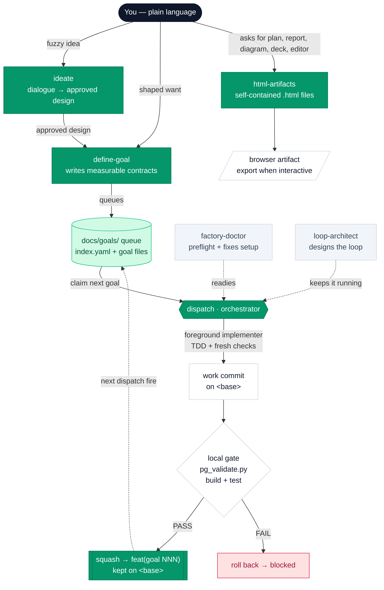

# flywheel

**Turn plain-language wants into autonomous execution.**
A skills-first plugin marketplace for [Claude Code](https://claude.com/claude-code),
from Pragmatic Growth.

[](https://flywheel.pragmaticgrowth.com)
[](CHANGELOG.md)
[](LICENSE)

> 🌐 **Full docs:** **<https://flywheel.pragmaticgrowth.com>**

---

## What is this?

flywheel gives you a small, focused toolkit for **describing what you want in
plain English and having agents actually build it** — with the guardrails that
keep an unattended agent loop from going off the rails.

You say *“I want the pricing page to load in under 1.2 seconds.”* The plugin
investigates your codebase, turns that into a **measurable contract** (what
“done” means, how to verify it), drops it into a **queue that lives in your
repo**, and then — when you’re ready — works that queue **one goal at a time**:
a foreground implementer commits directly on your current branch using TDD and
a lightweight subagent review loop (independent read-only lenses), the orchestrator
independently reviews the diff (a fresh adversarial second view — the implementer never
grades its own work) and runs a local
build + test gate, and only work that passes is kept (failures roll back).

That shape is the **proactive loops** pattern from Anthropic's official
["Getting started with loops"](https://x.com/ClaudeDevs/status/2074208949205881033)
guidance: scheduled dispatch over a work queue, goal contracts with verifiable
stop conditions, deterministic gate scripts, and fresh-context review.

It is **skills-first**: no MCP servers, no slash commands of its own, no
background daemons, no hooks, no build step — plus three
read-only [subagent](https://code.claude.com/docs/en/sub-agents) definitions
(`flywheel:gate-reviewer`, `flywheel:fresh-check`,
`flywheel:contract-red-team` — the factory's review roles, tool-restricted so
they can never edit files, and only used when a flywheel skill spawns them).
The marketplace
exposes four plugins: `flywheel` with six workflow
[skills](https://docs.claude.com/en/docs/claude-code/skills),
`html-artifacts` as a separate rich-deliverables plugin,
`autoresearch` for autonomous optimization loops, and
`human-writing` for AI-writing cleanup.

### Why a queue in the repo instead of GitHub issues?

Because issues have body-size limits, need per-repo label bootstrapping, and
drift away from the code. flywheel keeps goals as plain Markdown files
**versioned alongside your code** in `docs/goals/`. The queue is just the to-do
list, and it travels with the repo; verified commits land directly on your
branch through the local gate. (You can still open a PR yourself whenever you
want a review surface — flywheel just doesn't require one.)

---

## Marketplace plugins

| Plugin | What it contains | Install |
|---|---|---|
| **flywheel** | `ideate`, `define-goal`, `dispatch`, `goals-status`, `loop-architect`, and `factory-doctor` for the docs/goals execution pipeline. | `/plugin install flywheel@pragmatic-growth` |
| **html-artifacts** | One `html-artifacts` skill with references for self-contained browser deliverables. | `/plugin install html-artifacts@pragmatic-growth` |
| **autoresearch** | One `autoresearch` skill (+ a Python helper) for an autonomous try/measure/keep/revert optimization loop. | `/plugin install autoresearch@pragmatic-growth` |
| **human-writing** | One `human-writing` skill that strips AI-writing tells and adds human voice. | `/plugin install human-writing@pragmatic-growth` |

## The workflow skills

| Skill | One line | Invoke with |
|---|---|---|
| **ideate** | Fuzzy idea → a user-approved design through open dialogue, then handed to define-goal. Never writes goals or code. | `/ideate` · *“I have an idea…”* |
| **define-goal** | Plain-language want → a measurable, red-teamed goal contract (or a whole document of them). Never writes code. | `/define-goal …` · or just say *“I want…”* |
| **dispatch** | The factory orchestrator: works ready goals one at a time — claim, implement with TDD + fresh checks, independent-review-backed local gate, keep or roll back. Default one goal; flags run a batch. | `/dispatch` · `/dispatch 005` · `/dispatch --count 3` · `/dispatch --unlimited` |
| **goals-status** | Read-only view of the open queue: every `in_progress` / `blocked` / `not_started` goal with its title + brief (completed hidden). | `/goals-status` |
| **loop-architect** | Designs the *loop contract* (prompt + verification + stop conditions) for autonomous, scheduled, or remote runs. | *“keep working on X”* · setting up a `/loop`, routine, or cron |
| **factory-doctor** | One-pass preflight/doctor for the repo + machine. Auto-fixes everything local; reports the rest with exact fixes. | `/factory-doctor` |

In Claude Code the workflow skills are namespaced — `flywheel:define-goal`,
etc. `html-artifacts` installs as its own plugin and exposes
`html-artifacts:html-artifacts`. Skills also activate **automatically** when
your message matches what they’re for, so most of the time you don’t type the
name at all.

### ideate — explore an idea into a design

The pipeline's front door for **fuzzy ideas**. When you don't yet know exactly
what you want built — "what if we…", "I have an idea…" — ideate runs an open
design dialogue instead of jumping to a contract:

- **Context first.** It orients in your repo (read-only) before asking anything,
  so questions go to purpose, constraints, and success — never to things the
  code already answers.
- **Split before detail.** If the idea is really several independently shippable
  pieces, it surfaces that decomposition before refining any one piece — the
  pieces map 1:1 onto future goals and their `depends_on` chain.
- **Real alternatives.** 2–3 approaches with trade-offs, recommendation first.
  No round cap — the dialogue runs while answers still change the design.
- **Hard gate.** Its only exit is handing the approved design to define-goal
  (single goal, or batch mode for a chain). It never writes goal files, queue
  entries, or code. Multi-goal chains get one short design brief in
  `docs/goals/briefs/` that every chain goal links from its Context.

An already-shaped want ("add rate limiting, 429 over 100 req/min") skips ideate
entirely — that goes straight to define-goal.

### define-goal — capture wants as contracts

The contract writer — and the direct entrance for already-shaped wants. Give it
a sentence, a paragraph, a whole bug-report
document, or an ideate-approved design, and it produces **goal contracts** —
never implementation.

- **Recon first, by default.** Before writing a single success criterion, it
  sends parallel read-only agents to investigate the actual system (your repo,
  a separate service, a database — wherever it lives). Those agents inherit the
  current model; flywheel does not force Sonnet for recon. “The description
  sounded clear” is the failure mode this replaces.
- **Brief first, then a real artifact.** If outcome, environment, validator,
  scope, or risk is missing, it asks one concise question round, then finishes
  with either a run-now command or a queued goal file — not open-ended advice.
- **Red-teamed before it queues.** Every queued goal gets a **contract
  review**: one fresh read-only agent tries to break the drafted contract —
  gameable criteria, commands that don't exist in your repo, a bug goal whose
  gate never runs the proving test, missing scope or termination — before the
  model stamp and your confirmation. A contract defect caught here costs one
  read-only agent; the same defect at dispatch time costs a full implementer
  run plus a rollback.
- **Per-goal implementer model, stamped last.** Every queued goal's frontmatter
  carries `model:` (`inherit | opus | sonnet | haiku`), chosen AFTER the
  acceptance criteria are final: a tight, objectively-checkable contract
  defaults to `sonnet` (the judgment was front-loaded into the contract), while
  flagship design craft, wide-blast-radius refactors, and ambiguous root-cause
  work get `opus`. Dispatch reads it per goal when spawning the implementer;
  the orchestrator itself always stays on your session model.
- **Two destinations.** It can hand you a copy-pasteable **run-now** line
  (`/goal …`), or **queue**
  a goal file (`docs/goals/NNN-slug.md` + an `index.yaml` entry) to be worked
  later by dispatch.
- **Grounded in your repo.** It copies your `CLAUDE.md` rules
  verbatim into the contract, fills in *real* verification commands, and
  auto-populates the goal’s `touches:` / `acceptance:` fields from recon.
- **Batch mode.** Hand it a list (feedback doc, meeting notes, a backlog) and
  it drafts every goal, then gates the file writes behind an approval table.

```text
> I want signups to send a welcome email within 30 seconds
  define-goal ▸ recon (3 read-only agents) ▸ contract ▸ contract review
  ✓ queued  docs/goals/021-welcome-email.md   type: feature
```

### html-artifacts plugin — make rich deliverables readable

The browser-file sidecar lives as a separate plugin in the same marketplace. Use
it for work that markdown flattens: implementation plans, specs, PR reviews,
codebase tours, diagrams, research explainers, status reports, decks,
prototypes, and custom editors.

- **One skill, many references.** The skill has a small trigger/routing front
  door, then loads category references only when needed: planning,
  code-review, design/prototypes, diagrams/data, research/reports, editors,
  decks, and source coverage.
- **Self-contained files.** It writes real `.html` artifacts with inline CSS
  and JavaScript — no server, no listener, no build step, no new plugin
  surface.
- **Round-trip editors.** If the user manipulates state (triage, tuning,
  annotation, selection), the artifact includes an export/copy button that
  returns JSON, markdown, CSV, or prompt text back to the agent.
- **Default only when it helps.** Short chat answers, code-only snippets, and
  command sequences stay in markdown.

### dispatch — work the queue

The orchestrator. It works ready goals **one at a time** on the currently
checked-out branch — no PRs, no worktrees, no parallel implementers. By default
one goal per run; use
`/loop /dispatch` to repeat that cycle until the queue is drained, or size the
run directly:

```bash
/dispatch               # next ready goal, then stop
/dispatch 087           # exactly goal 087 (solo mode)
/dispatch --count 3     # up to 3 ready goals, sequentially
/dispatch --unlimited   # drain the queue (attended) — budget & brakes still apply
```

Batch runs repeat the same fully-settled per-goal cycle; a blocked goal doesn't
stop the batch, `config.budget` always outranks the flags, and an environment
brake stops a batch when two consecutive goals fail with the same
infrastructure-shaped cause (pointing you at `/factory-doctor` instead of
burning the queue).

Per goal:

1. **Claim** the next `not_started` goal (flip one entry → commit on the
   current branch).
2. **Implement** — a foreground implementer commits work directly on `<base>`,
   using a short plan/checklist, TDD for code changes, and a fresh multi-lens
   review (a small panel of independent read-only lenses) for non-trivial work.
3. **Local gate** — the orchestrator first spawns a fresh read-only reviewer
   to adversarially check the diff against the contract (the implementer’s
   self-review is evidence, not the verdict), then runs the repo’s `config.verify`
   commands (build + tests), and `pg_validate.py` runs the per-goal acceptance +
   structural checks on the `gate_base..HEAD` diff.  
   - **PASS** → the implementer’s commits are squashed into one
     `feat(goal NNN)` commit kept on the branch.  
   - **FAIL** → work is rolled back; the goal is marked `blocked`.
4. **Stop or continue** per the run's flags: a flagless run stops after this
   goal; a batch run claims the next ready goal. A later `/dispatch` run picks
   up the next ready goal; `/loop /dispatch` repeats automatically.

CI, if present, is a post-push observation — not a gate. If an implementer gets
stuck, an escalation ladder runs before the goal blocks: a missing-information
stop (`NEEDS_CONTEXT`) gets answered and re-spawned once, a capability-shaped
blocker on a cheap-stamped goal gets one re-spawn on the stronger model, and a
too-large/wrong contract routes to a human amendment.

### goals-status — see what's open

A read-only glance at the queue. `/goals-status` prints every goal that is
**in_progress**, **blocked**, or **not_started** — each with its title and a
one-line brief — grouped in that order. Completed goals are hidden (just
counted). Blocked goals show their reason; a goal waiting on an unfinished
dependency shows what it's waiting on.

```text
docs/goals — 3 open · 5 completed (hidden)

▶ IN PROGRESS  (1)
  002-rate-limit-api                       feature · sonnet
  Rate-limit the public API
  › Callers hitting /api/* more than 100×/min get a 429 instead of
    silently degrading the service for everyone.

⛔ BLOCKED  (1)
  005-receipt-dupes                        bug · opus
  Stop duplicate receipt emails
  › Some customers receive two receipts for a single payment.
  ✗ reason: gate FAIL — repro test still red after 3 attempts

○ NOT STARTED  (1)
  006-invoice-pdf                          feature · sonnet
  Export invoices as a monthly PDF
  › Finance can download one month of invoices as a single PDF.
  ⏳ waiting on 002-rate-limit-api
```

It never changes the queue or starts work — that's `/dispatch`.

### loop-architect — make it run itself, safely

Automating work is easy to get wrong: a naive “keep doing X” loop never knows
when it’s finished and can burn for hours. loop-architect designs the **loop
contract** instead — the prompt, the verification step, and the **stop
conditions**. Use it whenever you want something to
run unattended, on a schedule, or remotely. If the cadence, gate, budget, or
stop condition is unclear, it asks a short calibration round before writing the
copy-pasteable setup. For unattended runs on subscription plans it also designs
**usage-limit proofing**: a 5-hour/weekly limit blocks every turn until reset
and kills an in-session `/loop` with no hook fired, so the limit-proof shape is
an OS scheduler (cron/launchd) firing fresh `claude -p "/dispatch"` sessions —
optionally reading the reset clock from the statusline `rate_limits.*.resets_at`
fields or a `StopFailure` hook marker.

### factory-doctor — get the environment ready

Run this **before your first `/dispatch`**, or any time the factory behaves
like the environment isn’t ready. It checks software, `gh` auth + scopes, the
local gate (`config.verify` present and runnable), a clean working tree, the
working branch, CI, the queue itself, and loop health — stale claims,
underspecified goals, and **usage-limit exposure** (a repo whose dispatch loop
demonstrably fires but has no rail that survives an account limit stop) —
**auto-fixing everything local**
(scaffolding the queue, stripping deprecated v3 config keys —
`merge`/`wip`/`execution`/`autonomy` — from a stale `index.yaml`, and checking
`.claude/` settings) and
reporting remote/CI issues with the exact fix. It diagnoses and fixes setup; it
never implements goals.

### autoresearch plugin — optimize by experiment

A separate plugin in the same marketplace for a different job: **autonomously
optimizing a measurable metric**. Point it at a benchmark (training loss, test
runtime, bundle size, build time…) and it runs a disciplined loop — try one
hypothesis, measure, keep the change if it improves and revert it if it doesn't,
then repeat — with **MAD-based confidence scoring** to tell a real gain from
noise.

- **Isolated and resumable.** Work happens on an `autoresearch/<goal>-<date>`
  branch; all state lives in files (`autoresearch.md`, `autoresearch.sh`,
  `autoresearch.jsonl`) so a fresh session with no memory reads them and
  continues exactly where the last one stopped.
- **Runs unattended.** Let it loop in one session, or wrap the resume in `/loop`.
- **Clean output.** On termination it groups the kept experiments into
  independently-mergeable branches for review — the raw experiment branch is
  always preserved.

### human-writing plugin — make text sound human

The fourth plugin does one focused thing: **edit AI-sounding text into something a
person would actually write.** It scans for the tells catalogued in Wikipedia's
"Signs of AI writing" — inflated significance, promotional language, `-ing` filler,
em-dash and rule-of-three overuse, AI vocabulary, vague attributions, and chatbot
artifacts ("I hope this helps!") — rewrites them, and pushes for real voice
(opinions, varied rhythm, specific detail) instead of clean-but-soulless prose.

- **Pure guidance, no runtime.** One skill, no scripts or state. Use it when writing
  or reviewing markdown, docs, emails, blog posts, or PRDs.
- **Sourced and attributed.** Based on Wikipedia's "Signs of AI writing" (WikiProject
  AI Cleanup, CC BY-SA).

---

## How it all fits together



The intended flow: **explore** fuzzy ideas with ideate → **capture** wants with
define-goal → **work** the queue with
dispatch → **keep it running** unattended with a loop designed by
loop-architect. html-artifacts handles rich browser deliverables along the way,
and factory-doctor makes sure the ground is solid first.

---

## The docs/goals queue

Goals live in the target repo, versioned with the code:

```
docs/goals/
├── index.yaml        # config + queue state — status lives ONLY here
├── 001-faster-checkout.md     # goal contract — content only, never status
├── 002-fix-auth-redirect.md
└── done/             # archived completed goal files
```

**Status lives only in `index.yaml`** (never in goal-file frontmatter —
dual-writing drifts). Goal files are immutable contracts. Statuses move
`not_started → in_progress → completed`, plus `blocked` (always with a reason,
so a blocked goal is surfaced for you rather than re-dispatched into a livelock).

A goal file is just readable Markdown with a little frontmatter:

```markdown
---
id: "001"
type: feature            # bug | feature | chore — shapes the contract
skills: [test-driven-development]
touches: [src/checkout/, src/cart/total.ts]
acceptance: "pnpm test checkout && pnpm playwright test checkout.spec"
---

# Faster checkout

## Success criteria
- [ ] Checkout route renders in < 1.2s (p95) on a cold cache
- [ ] All existing checkout tests stay green

## Out of scope
- Redesigning the cart UI
```

The `type:` shapes the contract: **bugs** must lead with a failing test that
reproduces the root cause; **features** must fill in *Out of scope*; **chores**
must prove no behavior change (suite green before and after).

### The claim protocol

Every status write is **flip one entry → commit** (`chore(goals):
claim|complete|block|archive <id>`) on the current branch — one entry per
commit. The single session owns the branch, so there is no push-arbitration;
push is an optional backup only. Implementer agents work directly on `<base>`
and **never touch `docs/goals/` at all** — only the orchestrator does.

---

## Configuration

The `config:` block at the top of `index.yaml` is the repo owner’s control
panel. Everything has a sensible default — an unconfigured repo just works.

```yaml
config:
  base: main              # branch dispatch works on and commits to
  model: inherit          # code-agent default: inherit | opus | sonnet | haiku
                          #   (a goal's own frontmatter model: overrides per goal)
  # --- optional ---
  skills: []              # skills every implementer must invoke
  verify:                 # ordered local build + test gate (run before keeping a commit)
    - pnpm build
    - pnpm test
  budget:                 # external "burnstop" for long unattended runs
    max_goals_per_session: 1
    max_iterations: 200
```

| Key | Default | What it does |
|---|---|---|
| `base` | repo default branch | The branch dispatch works on — implementers commit here directly. Per-goal `base:` override allowed. |
| `model` | `inherit` | Repo-wide **default** model for spawned **code** agents (`inherit`/`opus`/`sonnet`/`haiku`). Each goal's frontmatter `model:` — stamped by define-goal from a contract-tightness rubric — overrides it per goal. The depth-vs-quota trade. Recon subagents and the orchestrator always stay on the current session model. |
| `skills` | — | Repo-wide skills every implementer must use (e.g. your TDD or review skills). |
| `verify` | — | Ordered list of local build + test commands. Run by the dispatch orchestrator after each implementation; PASS keeps the squash commit, FAIL rolls it back. |
| `budget` | none | `max_goals_per_session` / `max_iterations` ceilings the loop can’t exceed — the external brake on a long run. It always outranks a batch flag: `--unlimited` still stops at the cap. |

---

## Install

```bash
/plugin marketplace add pragmaticgrowth/flywheel
/plugin install flywheel@pragmatic-growth
/plugin install html-artifacts@pragmatic-growth
/plugin install autoresearch@pragmatic-growth
/plugin install human-writing@pragmatic-growth
```

Pull updates later with `/plugin marketplace update pragmatic-growth`, then update
any installed plugin from the Installed tab.

### Quick start

```bash
/factory-doctor                              # 1. make sure the repo + machine are ready
/ideate what if signups had a referral loop  # (optional) explore a fuzzy idea into a design
/define-goal I want the API p95 latency under 200ms   # 2. capture a want → queued contract
/dispatch                                    # 3. work one ready goal (--count N / --unlimited for more)
```

That’s the whole arc: preflight, capture, work. Add more goals any time —
define-goal appends to the queue, and `/dispatch` (or `/loop /dispatch`) picks
them up. Set `config.budget` in `index.yaml` before long unattended runs.

---

## The local gate

After each implementation, the dispatch orchestrator first runs an
**independent review**: for any non-trivial diff it spawns one fresh read-only
adversarial reviewer (the plugin's tool-restricted `flywheel:gate-reviewer`
agent where available, a `general-purpose` agent with the same brief
otherwise) over `gate_base..HEAD` plus the goal contract — refute
conformance, test realness, and scope; the implementer’s own fresh-check
verdicts are corroborating evidence, never the verdict. Then it runs the repo’s
`config.verify` commands (build + tests), and `pg_validate.py` runs the
per-goal acceptance + structural checks on the local `gate_base..HEAD` diff:

- All `verify` commands must exit 0.
- A secret / forbidden-content scan.

It emits a verdict — **PASS** or **FAIL** — and the orchestrator acts on it:
PASS squashes the implementer’s commits into one `feat(goal NNN)` commit kept
on the branch; FAIL rolls the work back and marks the goal `blocked`. CI,
if configured, runs after the push as a non-blocking observation.

(FAIL is itself two internal verdicts — a *fixable* failure gets one repair pass
before rollback, a *contract* failure rolls back for a human. A third verdict,
**INCONCLUSIVE**, means the gate could not run at all — no runnable `config.verify`
or test command — which is a setup gap, not a code failure: run `/factory-doctor`.)

---

## Running it autonomously

`/dispatch` works one ready goal and stops; `--count N` / `--unlimited` run an
attended sequential batch of the same cycle. Each settled goal reports
**progress-first**:
`6/8 done ████████████████░░░░ · ready 0 · blocked 2`.

If you want the queue to keep moving without re-running manually, `/loop
/dispatch` keeps firing the same one-goal cycle. Use `config.budget` as the
burnstop — an external ceiling the loop **cannot edit itself**, so a flaky queue
can’t burn indefinitely. When the budget is hit (or the queue drains), dispatch
stops and surfaces the reason. Let **loop-architect** design the loop contract
(verification + stop conditions) rather than firing a bare prompt.

One caveat for overnight runs on subscription plans: a **usage limit** (5-hour
or weekly window) blocks every turn until reset and silently kills an
in-session `/loop` — no hook fires, and the CLI has no built-in auto-resume.
The limit-proof shape is scheduling *outside* the session (cron/launchd firing
fresh `claude -p "/dispatch"` runs) — each
fire is idempotent, so the first fire after reset just continues the queue.
Dispatch’s heartbeat log and fires-observed brake keep a quota pause from being
misread as a dead goal, and `/factory-doctor` warns when a looping repo has no
limit rail.

---

## Versioning & changelog

- **[CHANGELOG.md](CHANGELOG.md)** — the canonical, human-readable history of
  every release, each entry linked to its commit.
- **Git tags** — every release is tagged `vX.Y.Z` on its commit, so the version
  history is browsable on GitHub.
- **The site** — <https://flywheel.pragmaticgrowth.com> hosts the full docs and
  install (canonical version history lives in CHANGELOG.md and GitHub Releases).

The `flywheel` plugin version lives in `.claude-plugin/plugin.json`; the
`html-artifacts` plugin version lives in
`plugins/html-artifacts/.claude-plugin/plugin.json`. The public site is
regenerated and redeployed on each release (see `CLAUDE.md` →
*Public site & changelog*).

---

## Project layout

```
flywheel/
├── .claude-plugin/
│   ├── plugin.json        # flywheel plugin manifest
│   └── marketplace.json   # the pragmatic-growth marketplace, listing all four plugins
├── skills/
│   ├── ideate/SKILL.md
│   ├── define-goal/SKILL.md
│   ├── dispatch/
│   │   ├── SKILL.md
│   │   └── scripts/
│   │       └── pg_validate.py         # local gate: per-goal acceptance + structural checks, PASS/FAIL verdict
│   ├── goals-status/
│   │   ├── SKILL.md
│   │   └── scripts/goals_status.py    # read-only view of the open queue
│   ├── factory-doctor/
│   │   ├── SKILL.md
│   │   └── scripts/doctor_checks.py   # read-only readiness probe
│   └── loop-architect/SKILL.md
├── plugins/
│   ├── html-artifacts/
│   │   ├── .claude-plugin/plugin.json
│   │   └── skills/html-artifacts/
│   │       ├── SKILL.md
│   │       └── references/            # HTML artifact recipes and foundation rules
│   ├── autoresearch/
│   │   ├── .claude-plugin/plugin.json
│   │   └── skills/autoresearch/
│   │       ├── SKILL.md
│   │       └── scripts/autoresearch_helper.py  # stdlib JSONL + MAD-confidence helper
│   └── human-writing/
│       ├── .claude-plugin/plugin.json
│       └── skills/human-writing/SKILL.md       # AI-writing cleanup guidance (no scripts)
├── public/                # the flywheel.pragmaticgrowth.com site (index.html + brand SVGs)
├── wrangler.jsonc         # Cloudflare deploy config for the site
├── CHANGELOG.md           # canonical version history
└── CLAUDE.md              # contributor guide
```

---

## Contributing & maintenance

This repo is the single source of truth — all four plugins install from the
`pragmatic-growth` marketplace and refresh from GitHub. If you’re editing
skills, read **[CLAUDE.md](CLAUDE.md)**: it documents the queue design
invariants, the release flow (bump `plugin.json` → update `CHANGELOG.md` + the
site → tag → push → refresh), and the rule that skills stay portable (no
user-specific absolute paths). New or changed skill mechanics get a subagent
dry-run before shipping.

---

## License

[MIT](LICENSE) © Pragmatic Growth
