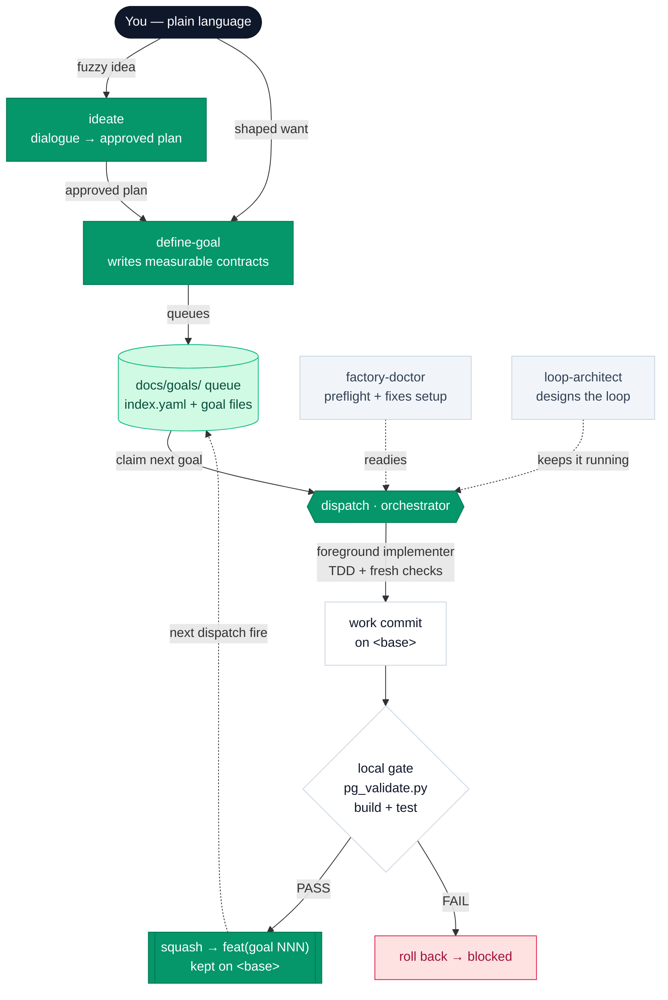

# flywheel

**Turn plain-language wants into autonomous execution.**
A skills-first plugin marketplace for [Claude Code](https://claude.com/claude-code)
and [Factory Droid](https://factory.ai), from Pragmatic Growth.

[](https://flywheel.pragmaticgrowth.com)
[](CHANGELOG.md)
[](LICENSE)

> 🌐 **Full docs:** **<https://flywheel.pragmaticgrowth.com>**

---

## What is this?

flywheel gives you a small, focused toolkit for **describing what you want in
plain English and having agents actually build it** — with the guardrails that
keep an unattended agent loop from going off the rails.

You say *“I want the pricing page to load in under 1.2 seconds.”* The plugin
investigates your codebase, turns that into a **measurable contract** (what
“done” means, how to verify it), drops it into a **queue that lives in your
repo**, and then — when you’re ready — works that queue: serially one goal at
a time by default, or with opt-in **parallel build lanes** that still integrate
one verified goal at a time.
A foreground implementer commits its work using TDD and
a lightweight subagent review loop (independent read-only lenses), the orchestrator
independently reviews the diff (a fresh adversarial second view — the implementer never
grades its own work) and runs a local
build + test gate, and only work that passes is kept (failures roll back).

That shape is the **proactive loops** pattern from Anthropic's official
["Getting started with loops"](https://x.com/ClaudeDevs/status/2074208949205881033)
guidance: scheduled dispatch over a work queue, goal contracts with verifiable
stop conditions, deterministic gate scripts, and fresh-context review.

It is **skills-first**: no MCP servers, no slash commands of its own, no
background daemons, no hooks, no build step — plus three
read-only [subagent](https://code.claude.com/docs/en/sub-agents) definitions
(`flywheel:gate-reviewer`, `flywheel:fresh-check`,
`flywheel:contract-red-team` — the factory's review roles, tool-restricted so
they can never edit files, and only used when a flywheel skill spawns them).
They work as
[subagents](https://code.claude.com/docs/en/sub-agents) on Claude Code and as
[custom droids](https://docs.factory.ai/cli/configuration/custom-droids) on
Factory Droid, with allowlists naming only tool IDs one of the two harnesses
defines. One platform difference is load-bearing: a Claude Code subagent can
spawn further subagents, a Droid subagent cannot (no `Task` tool), so a
dispatch implementer runs its fresh-check panel directly on Claude Code and via
`droid exec` on Droid — never by reviewing its own diff in its own context.
The marketplace
exposes one plugin: `flywheel`, with six workflow
[skills](https://docs.claude.com/en/docs/claude-code/skills).

### Why a queue in the repo instead of GitHub issues?

Because issues have body-size limits, need per-repo label bootstrapping, and
drift away from the code. flywheel keeps goals as plain Markdown files
**versioned alongside your code** in `docs/goals/`. The queue is just the to-do
list, and it travels with the repo; verified commits land directly on your
branch through the local gate. (You can still open a PR yourself whenever you
want a review surface — flywheel just doesn't require one.)

---

## The marketplace

| Plugin | What it contains | Install |
|---|---|---|
| **flywheel** | `ideate`, `define-goal`, `dispatch`, `goals-status`, `loop-architect`, and `factory-doctor` for the docs/goals execution pipeline. | `/plugin install flywheel@pragmatic-growth` |

## The workflow skills

| Skill | One line | Invoke with |
|---|---|---|
| **ideate** | Fuzzy idea → an approved **plan** (v11.0.0): one code-shaped design document with vertical-slice phases and open questions only you can resolve — in ONE approval touch. Never writes goals or code. | `/ideate` · *“I have an idea…”* |
| **define-goal** | Plain-language want → a measurable, red-teamed goal contract (or a whole document of them). Plan-backed wants get **zero question rounds**. Never writes code. | `/define-goal …` · or just say *“I want…”* |
| **dispatch** | The factory orchestrator: claim, implement with TDD + fresh checks, independent-review-backed local gate, keep or roll back. **Drains the queue by default** (v10.0.0) and **auto-parallelizes** disjoint goals when `config.parallel` is set (v11.0.0); `--count N` limits, `--serial` forces one-at-a-time. | `/dispatch` · `/dispatch 005` · `/dispatch --count 3` · `/dispatch --parallel 3` |
| **goals-status** | Read-only view of the open queue: every `in_progress` / `blocked` / `not_started` goal with its title + brief (completed hidden). | `/goals-status` |
| **loop-architect** | Designs the *loop contract* (prompt + verification + stop conditions) for autonomous, scheduled, or remote runs. | *“keep working on X”* · setting up a `/loop`, routine, or cron |
| **factory-doctor** | One-pass preflight/doctor for the repo + machine. Auto-fixes everything local; reports the rest with exact fixes. | `/factory-doctor` |

In Claude Code the workflow skills are namespaced — `flywheel:define-goal`,
etc. Skills also activate **automatically** when
your message matches what they’re for, so most of the time you don’t type the
name at all.

### ideate — explore an idea into a plan

The pipeline's front door for **fuzzy ideas**. When you don't yet know exactly
what you want built — "what if we…", "I have an idea…" — ideate designs first
and writes a **plan** (`docs/goals/plans/YYYY-MM-DD-topic.md`, v11.0.0), the
factory's design tier. Forensics across real factory repos showed the true
cycle-time killer was never implementation — it was design forks surfacing
mid-execution as blocked goals that took 10–85 hours of amend round-trips. The
plan resolves those forks up front, where they cost minutes:

- **Context first.** It orients in your repo (read-only) before asking anything.
- **Vertical slices.** The decomposition must cut end-to-end paths, never
  layers: if a piece can't be verified without a LATER piece existing, it isn't
  a slice. Each phase maps 1:1 onto a future goal.
- **Code-shaped design.** Where the work touches existing code, the plan
  carries exact signatures (bodies elided), a created/modified file diff, and
  call flows only where non-obvious — every heading states its takeaway, so
  skimming the headers alone gives you the design's actual claims.
- **Open questions, ONE approval touch.** Design forks become an
  `## Open questions` section — options, a recommendation each — instead of a
  question interrogation. You answer any subset, or say **"go with your
  recommendations"** and every question resolves at once, each keeping its
  one-line why forever. That presentation is the single touchpoint.
- **A living document.** As dispatch completes each phase's goal, it checks the
  phase off in the plan — one file shows the whole effort's progress.
- **Hard gate.** Its only exit is handing the approved plan to define-goal.
  It never writes goal files, queue entries, or code.

An already-shaped want ("add rate limiting, 429 over 100 req/min") skips ideate
entirely — that goes straight to define-goal. Simple single-goal ideas stay
fileless. (Pre-v11 design briefs in `docs/goals/briefs/` stay valid where
linked.)

### define-goal — capture wants as contracts

The contract writer — and the direct entrance for already-shaped wants. Give it
a sentence, a paragraph, a whole bug-report
document, or an ideate-approved plan, and it produces **goal contracts** —
never implementation.

- **Recon first, by default.** Before writing a single success criterion, it
  sends parallel read-only agents to investigate the actual system (your repo,
  a separate service, a database — wherever it lives). Gather agents run on
  the medium tier (fast, strong tool use); the synthesis step and the contract
  itself stay on your session model, so the judgment never runs cheap. “The
  description sounded clear” is the failure mode this replaces.
- **Plan-backed wants skip the interview entirely (v11.0.0).** When ideate
  hands over an approved plan, define-goal runs **zero question rounds** — the
  plan was the interview. The plan's phases become the goals (one each,
  `depends_on` in phase order), every goal links the plan from its Context, and
  the plan's code-shaped Design section replaces per-goal interface notes.
- **Question diet everywhere else (v11.0.0).** A question round happens only
  when a question has no confident recommended default; otherwise define-goal
  takes the defaults and states its assumptions in the one draft confirmation
  you were getting anyway. Goal files themselves went on a diet too: the two
  boilerplate sections that repeated verbatim in every file now live once in
  dispatch's implementer brief, cutting a typical goal file from ~150 lines to
  under 60 with zero information lost.
- **Red-teamed before it queues.** Every queued goal gets a **contract
  review**: one fresh read-only agent tries to break the drafted contract —
  gameable criteria, commands that don't exist in your repo, a bug goal whose
  gate never runs the proving test, missing scope or termination, an
  **oversized goal** (more than one implementer sitting — one subsystem, one
  drivable surface, roughly ≤5 criteria — gets split into a `depends_on`
  chain unless the contract states why it's atomic), and a **horizontal cut**
  (v11.0.0 slice check: a goal whose criteria can't be verified without a
  LATER goal in its own chain existing gets re-cut vertically) — before the
  model stamp and your confirmation. A contract defect caught here costs one
  read-only agent; the same defect at dispatch time costs a full implementer
  run plus a rollback.
- **Per-goal implementer tier, stamped last.** Every queued goal's frontmatter
  carries `model:` (`inherit | heavy | medium | light`; legacy
  opus/sonnet/haiku stamps read as heavy/medium/light aliases), chosen AFTER
  the acceptance criteria are final: features and bugs default to `heavy` —
  execution quality is the factory's product — while genuinely mechanical work
  (rote edits, ports with an exact source of truth, config/doc sweeps) gets
  `medium`. Dispatch reads it per goal when spawning the implementer (on
  Claude Code the tier pins the model; on Factory Droid it sets the Task
  `complexity`); the orchestrator itself always stays on your session model.
- **Two destinations.** It can hand you a copy-pasteable **run-now** line
  (`/goal …`), or **queue**
  a goal file (`docs/goals/NNN-slug.md` + an `index.yaml` entry) to be worked
  later by dispatch.
- **`--amend <id>` — repair a blocked contract.** When dispatch blocks a goal
  with a *contract defect* (a criterion with two readings, an unreachable
  check, a goal too large for one run), its needs-you line points here:
  `/define-goal --amend 004` reads the goal file, the blocker reason, and the
  implementer's report, asks you ONE plain-language round with options and a
  recommended default, rewrites **only** the defective criteria, records a
  one-line amendment note so the next implementer can't re-open the same fork,
  re-runs the contract red-team, and requeues the goal
  (`chore(goals): amend <id>` — status back to `not_started`, stale reason
  cleared). It refuses any goal that isn't `blocked`, and never auto-amends.
- **Grounded in your repo.** It copies your `CLAUDE.md` rules
  verbatim into the contract, fills in *real* verification commands, and
  auto-populates the goal’s `touches:` / `acceptance:` fields from recon.
- **Batch mode.** Hand it a list (feedback doc, meeting notes, a backlog) and
  it drafts every goal, then gates the file writes behind an approval table.

```text
> I want signups to send a welcome email within 30 seconds
  define-goal ▸ recon (3 read-only agents) ▸ contract ▸ contract review
  ✓ queued  docs/goals/021-welcome-email.md   type: feature
```

### dispatch — work the queue

The orchestrator. It works ready goals on the currently checked-out branch,
with no PRs and no remote branches. The core invariant: **at most one goal
integrates at a time, and the branch only ever advances to gate-verified
trees.** Since v10.0.0 a flagless run **drains the queue** — it keeps working
ready goals, one fully-settled cycle after another, until the queue is empty
or a brake fires; `/loop /dispatch` only re-drains as new goals arrive:

```bash
/dispatch                    # drain — auto-parallel lanes when config.parallel is set (v11.0.0)
/dispatch 087                # exactly goal 087 (solo mode)
/dispatch --count 3          # up to 3 ready goals, then stop (--count 1 = single-goal fire)
/dispatch --parallel 3       # force lane mode with up to 3 concurrent build lanes
/dispatch --serial           # force one-at-a-time for this run
```

Lane mode (v9.0.0, Claude Code only, cap 4 lanes) builds provably-disjoint
goals **concurrently in disposable local worktree lanes** —
admission-controlled by each goal's `touches:` globs, dependency chains, and
always-exclusive conflict domains (lockfiles, migrations, CI/config) — while
still **integrating strictly one goal at a time**: each lane is rebased onto
the branch head, the deterministic gate re-runs on that exact integrated tree,
and the branch fast-forwards only to verified states. A rebase conflict never
gets guessed through — the lane is discarded and the goal re-runs serially.
Since v11.0.0 a flagless drain **enters lane mode automatically** when the
queue's `config.parallel` block exists (your standing opt-in), the harness is
Claude Code, and ≥2 ready goals are co-schedulable — `--serial` forces the old
behavior; without `config.parallel` nothing changes.

A drain repeats the same fully-settled per-goal cycle; a blocked goal doesn't
stop the run, `config.budget` always outranks the flags, and an environment
brake stops a run when two consecutive goals fail with the same
infrastructure-shaped cause (pointing you at `/factory-doctor` instead of
burning the queue). The count meters **claims**: settling a goal that was
already in flight when the run started neither consumes a unit nor licenses
an extra one, so `--count 1` is always at most one new goal.

Per goal:

1. **Claim** the next `not_started` goal (flip one entry → commit on the
   current branch).
2. **Implement** — a foreground implementer commits work directly on `<base>`,
   using a short plan/checklist, TDD for code changes, and a fresh multi-lens
   review (a small panel of independent read-only lenses) for non-trivial work.
3. **Local gate** — two independent arms over the same frozen
   `gate_base..HEAD` range, overlapped to save wall-clock: the deterministic
   commands (`pg_validate.py` + the repo’s `config.verify` build + tests)
   start in the background while a fresh read-only reviewer adversarially
   checks the diff against the contract in the foreground (the implementer’s
   self-review is evidence, not the verdict); both arms must be in hand
   before any verdict.  
   - **PASS** → the implementer’s commits are squashed into one
     `feat(goal NNN)` commit kept on the branch.  
   - **FAIL** → work is rolled back; the goal is marked `blocked`.
4. **Stop or continue** per the run's flags: a flagless run stops after this
   goal; a batch run claims the next ready goal. A later `/dispatch` run picks
   up the next ready goal; `/loop /dispatch` repeats automatically.

CI, if present, is a post-push observation — not a gate. If an implementer gets
stuck, an escalation ladder runs before the goal blocks: a missing-information
stop (`NEEDS_CONTEXT`) gets answered and re-spawned once, a capability-shaped
blocker on a cheap-stamped goal gets one re-spawn on the stronger model, and a
too-large/wrong contract routes to a human amendment.

**Every needs-you item names the command that resolves it.** Anything waiting on
you is reported in one shape — `<id or item> — <reason> → <what to run>` — with
the command coming from a single blocker-class table: a contract defect →
`/define-goal --amend <id>`, an unrunnable gate or a stalled batch →
`/factory-doctor`, a transient death → `/dispatch <id>`, a red CI run →
`gh run view --log-failed`. Dispatch may also just *ask* you, but only when it
can see the run is attended (you invoked `/dispatch` conversationally, no batch
flag, not `/loop`/`claude -p`/`droid exec`) — one round, at most two questions,
options with a recommended default. Unsure? It writes the needs-you line instead;
an interactive question in an unattended fire is worse than none.

**Subjective criteria reach a human.** A criterion no command can settle is
marked `needs independent review` when the goal is written. On a PASS, dispatch
re-reads the goal file for that marker and surfaces each one under needs-you as
what to run and what to look for, drawn from the implementer's evidence — never
the criterion text echoed back. It is an observation, not a gate: the PASS still
completes the goal, so an unattended drain is never blocked waiting on you. A
goal with no such criteria surfaces nothing.

**Nothing survives as prose (settle triage, v10.0.0).** Before any goal
settles, every loose end the cycle produced — a `DONE_WITH_CONCERNS` concern,
a real-but-out-of-scope reviewer finding, a "needs a new goal" discovery — is
either repaired now, dismissed with stated reasoning, or **captured as one
committed line in `docs/goals/inbox.md`**. A goal is not "complete" while a
loose end is unclassified, and captured items don't evaporate with the chat:
`/define-goal` reads the inbox and converts items into real queued goals
(removing the converted lines). The per-goal cycle itself is never a
confirmation point — dispatch never stops mid-run to ask "want me to run the
repair?"; everything a human must know lands in needs-you or the inbox and the
run continues.

**"Done" means done (concerns diet, v11.0.0).** `DONE_WITH_CONCERNS` is legal
only when a concern genuinely qualifies the goal's own contract — a criterion
met but fragile. Honored scope boundaries, pre-existing baseline failures, and
discovered follow-ups are *not* concerns (they go to the report file and the
inbox), so a completed goal reads as completed instead of trailing a list of
things it correctly didn't do. Measured before the change: ~30 % of real
reports carried the status, mostly for honest scope discipline.

**Plans are the progress view (v11.0.0).** When a goal came from an ideate
plan, completing it checks that phase off in `docs/goals/plans/…` in the same
settle commit — one document shows the whole chain's design, decisions, and
progress. Display only: `index.yaml` stays the single status authority and
dispatch re-syncs a drifted checkbox from the index.

### goals-status — see what's open

A read-only glance at the queue. `/goals-status` prints every goal that is
**in_progress**, **blocked**, or **not_started** — each with its title and a
one-line brief — grouped in that order. Completed goals are hidden (just
counted). Blocked goals show their reason; a goal waiting on an unfinished
dependency shows what it's waiting on.

```text
docs/goals — 3 open · 5 completed (hidden)

▶ IN PROGRESS  (1)
  002-rate-limit-api                       feature · heavy
  Rate-limit the public API
  › Callers hitting /api/* more than 100×/min get a 429 instead of
    silently degrading the service for everyone.

⛔ BLOCKED  (1)
  005-receipt-dupes                        bug · heavy
  Stop duplicate receipt emails
  › Some customers receive two receipts for a single payment.
  ✗ reason: gate FAIL — repro test still red after 3 attempts

○ NOT STARTED  (1)
  006-invoice-pdf                          feature · heavy
  Export invoices as a monthly PDF
  › Finance can download one month of invoices as a single PDF.
  ⏳ waiting on 002-rate-limit-api
```

It never changes the queue or starts work — that's `/dispatch`.

### loop-architect — make it run itself, safely

Automating work is easy to get wrong: a naive “keep doing X” loop never knows
when it’s finished and can burn for hours. loop-architect designs the **loop
contract** instead — the prompt, the verification step, and the **stop
conditions**. Use it whenever you want something to
run unattended, on a schedule, or remotely. If the cadence, gate, budget, or
stop condition is unclear, it asks a short calibration round before writing the
copy-pasteable setup. For long runs on subscription plans it also designs
**usage-limit proofing**: a 5-hour/weekly limit blocks every turn until reset
and kills an in-session `/loop` with no hook fired, so the limit-proof shape is
**window-timed attended drains** — start `/dispatch` (drains by default; or
`--count N`) right after each limit reset and let the run drain the window,
reading the reset clock from the statusline `rate_limits.*.resets_at` fields
(optionally a `StopFailure` hook as a mid-turn death signal). The factory runs
in-subscription and in-session — no headless `claude -p` scheduling.

### factory-doctor — get the environment ready

Run this **before your first `/dispatch`**, or any time the factory behaves
like the environment isn’t ready. It checks software, `gh` auth + scopes, the
local gate (`config.verify` present and runnable), a clean working tree, the
working branch, CI, the queue itself, and loop health — stale claims,
underspecified goals, and **usage-limit exposure** (a repo whose dispatch loop
demonstrably fires but has no rail that survives an account limit stop) —
**auto-fixing everything local**
(scaffolding the queue, stripping deprecated v3 config keys —
`merge`/`wip`/`execution`/`autonomy` — from a stale `index.yaml`, and checking
`.claude/` settings) and
reporting remote/CI issues with the exact fix. It diagnoses and fixes setup; it
never implements goals.

---

## How it all fits together


```mermaid
flowchart TD
    you(["You — plain language"]) -->|fuzzy idea| id["ideate<br/>dialogue → approved plan"]
    id -->|approved plan| dg
    you -->|shaped want| dg["define-goal<br/>writes measurable contracts"]
    dg -->|queues| q[("docs/goals/ queue<br/>index.yaml + goal files")]
    q -->|claim next goal| dsp{{"dispatch · orchestrator"}}
    dsp -->|foreground implementer<br/>TDD + fresh checks| impl["work commit<br/>on &lt;base&gt;"]
    impl --> gate{"local gate<br/>pg_validate.py<br/>build + test"}
    gate -->|PASS| squash[["squash → feat(goal NNN)<br/>kept on &lt;base&gt;"]]
    gate -->|FAIL| rollback["roll back → blocked"]
    squash -.->|next dispatch fire| q
    fd["factory-doctor<br/>preflight + fixes setup"] -.->|readies| dsp
    la["loop-architect<br/>designs the loop"] -.->|keeps it running| dsp
    classDef brand fill:#059669,stroke:#047857,color:#ffffff;
    classDef store fill:#d1fae5,stroke:#10b981,color:#064e3b;
    classDef neutral fill:#ffffff,stroke:#cbd5e1,color:#0f172a;
    classDef human fill:#0f172a,stroke:#0f172a,color:#ffffff;
    classDef support fill:#f1f5f9,stroke:#cbd5e1,color:#334155;
    classDef warn fill:#fee2e2,stroke:#e11d48,color:#9f1239;
    class id,dg,dsp,squash brand
    class q store
    class impl,gate neutral
    class you human
    class fd,la support
    class rollback warn
```

The intended flow: **explore** fuzzy ideas with ideate → **capture** wants with
define-goal → **work** the queue with
dispatch → **keep it running** unattended with a loop designed by
loop-architect, with factory-doctor making sure the ground is solid first.

---

## The docs/goals queue

Goals live in the target repo, versioned with the code:

```
docs/goals/
├── index.yaml        # config + queue state — status lives ONLY here
├── 001-faster-checkout.md     # goal contract — content only, never status
├── 002-fix-auth-redirect.md
└── done/             # archived completed goal files
```

**Status lives only in `index.yaml`** (never in goal-file frontmatter —
dual-writing drifts). Goal files are immutable contracts, with `--amend` the one
exception: immutable to implementers and while a goal is claimable, editable only
by `/define-goal --amend <id>` on a **blocked** goal, which repairs the defective
criteria in place and requeues it. Statuses move
`not_started → in_progress → completed`, plus `blocked` (always with a reason,
so a blocked goal is surfaced for you rather than re-dispatched into a livelock).

A goal file is just readable Markdown with a little frontmatter:

```markdown
---
id: "001"
type: feature            # bug | feature | chore — shapes the contract
skills: [test-driven-development]
touches: [src/checkout/, src/cart/total.ts]
acceptance: "pnpm test checkout && pnpm playwright test checkout.spec"
---

# Faster checkout

## Success criteria
- [ ] Checkout route renders in < 1.2s (p95) on a cold cache
- [ ] All existing checkout tests stay green

## Out of scope
- Redesigning the cart UI
```

The `type:` shapes the contract: **bugs** must lead with a failing test that
reproduces the root cause; **features** must fill in *Out of scope*; **chores**
must prove no behavior change (suite green before and after).

### The claim protocol

Every status write is **flip one entry → commit** (`chore(goals):
claim|complete|block|archive <id>` from dispatch, plus define-goal's
`amend <id>` requeue of a blocked goal) on the current branch — one entry per
commit. The single session owns the branch, so there is no push-arbitration;
push is an optional backup only. Implementer agents work directly on `<base>`
and **never touch `docs/goals/` at all** — only the orchestrator does.

---

## Configuration

The `config:` block at the top of `index.yaml` is the repo owner’s control
panel. Everything has a sensible default — an unconfigured repo just works.

```yaml
config:
  base: main              # branch dispatch works on and commits to
  model: inherit          # code-agent default tier: inherit | heavy | medium | light
                          #   (a goal's own frontmatter model: overrides per goal;
                          #   legacy opus/sonnet/haiku values read as aliases)
  # --- optional ---
  skills: []              # skills every implementer must invoke
  verify:                 # ordered local build + test gate (run before keeping a commit)
    - pnpm build
    - pnpm test
  budget:                 # external "burnstop" for long unattended runs
    max_goals_per_session: 1
    max_iterations: 200
```

| Key | Default | What it does |
|---|---|---|
| `base` | repo default branch | The branch dispatch works on — implementers commit here directly. Per-goal `base:` override allowed. |
| `model` | `inherit` | Repo-wide **default** execution tier for spawned **code** agents (`inherit`/`heavy`/`medium`/`light`; legacy `opus`/`sonnet`/`haiku` values read as heavy/medium/light aliases). Each goal's frontmatter `model:` — stamped by define-goal from a contract-tightness rubric (heavy default for features/bugs, medium for mechanical work) — overrides it per goal. On Claude Code the tier pins the model; on Factory Droid it sets the Task `complexity`. The depth-vs-quota trade. Recon gather agents run on the medium tier; the orchestrator, synthesis, and review agents always stay on the current session model. |
| `skills` | — | Repo-wide skills every implementer must use (e.g. your TDD or review skills). |
| `verify` | — | Ordered list of local build + test commands. Run by the dispatch orchestrator after each implementation; PASS keeps the squash commit, FAIL rolls it back. |
| `budget` | none | `max_goals_per_session` / `max_iterations` ceilings the loop can’t exceed — the external brake on a long run. It always outranks the run: even a full drain stops at the cap. |

---

## Install

### Claude Code

```bash
/plugin marketplace add pragmaticgrowth/flywheel
/plugin install flywheel@pragmatic-growth
```

Pull updates later with `/plugin marketplace update pragmatic-growth`, then update
any installed plugin from the Installed tab.

### Factory Droid

```bash
droid plugin marketplace add https://github.com/pragmaticgrowth/flywheel
droid plugin install flywheel@flywheel
```

(Droid names the marketplace after the repo; `droid plugin marketplace list`
shows the exact name to use after `@`.) Pull updates later with
`droid plugin marketplace update` + `droid plugin update`. Droid translates the
Claude-layout plugins automatically — skills register under their bare names
and the three review agents become custom droids.

### Quick start

```bash
/factory-doctor                              # 1. make sure the repo + machine are ready
/ideate what if signups had a referral loop  # (optional) explore a fuzzy idea into a plan
/define-goal I want the API p95 latency under 200ms   # 2. capture a want → queued contract
/dispatch                                    # 3. drain the queue (--count N to limit the run)
```

That’s the whole arc: preflight, capture, work. Add more goals any time —
define-goal appends to the queue, and `/dispatch` (or `/loop /dispatch`) picks
them up. Set `config.budget` in `index.yaml` before long unattended runs.

---

## The local gate

After each implementation, the dispatch orchestrator runs the gate’s **two
independent arms over the same frozen `gate_base..HEAD` range, overlapped**:
the deterministic commands start in the background while the **independent
review** runs in the foreground — for any non-trivial diff, one fresh
read-only adversarial reviewer (the plugin's tool-restricted gate-reviewer
agent where available — `flywheel:gate-reviewer` on Claude Code, `gate-reviewer`
on Factory Droid — else a generic agent with the same brief) over
`gate_base..HEAD` plus the goal contract — refute
conformance, test realness, and scope; the implementer’s own fresh-check
verdicts are corroborating evidence, never the verdict. The reviewer runs on a
**hard budget** (~15 tool calls, ≤2 named out-of-diff risks; ~8 on a focused
re-check after a repair): it reads the diff and reports, and what it cannot
settle cheaply comes back as an `(uncertain)` finding for the orchestrator to
verify in one command. Re-running the suite, mutation-testing a copy of the
tree, or re-deriving what the diff computes is explicitly not its job — that
work is the implementer’s or the command arm’s, and an unbudgeted reviewer
costs ~8× on the same diff without finding more. The only legal
reviewer skip is a **one-file, evidenced-mechanical diff** (judged from the
diff itself, never the implementer’s claim), and the report line must say
which happened (`reviewed` / `review-skipped: mechanical`). The command arm —
the repo’s `config.verify` commands (build + tests), and `pg_validate.py`
running the per-goal acceptance + structural checks on the local
`gate_base..HEAD` diff:

- All `verify` commands must exit 0.
- A secret / forbidden-content scan.

Both arms must be in hand before any verdict — the overlap moves wall-clock,
never the bar. It emits a verdict — **PASS** or **FAIL** — and the orchestrator acts on it:
PASS squashes the implementer’s commits into one `feat(goal NNN)` commit kept
on the branch; FAIL rolls the work back and marks the goal `blocked`. CI,
if configured, runs after the push as a non-blocking observation.

(FAIL is itself two internal verdicts — a *fixable* failure gets one repair pass
before rollback, a *contract* failure rolls back for a human. A third verdict,
**INCONCLUSIVE**, means the gate could not run at all — no runnable `config.verify`
or test command — which is a setup gap, not a code failure: run `/factory-doctor`.)

---

## Running it autonomously

`/dispatch` drains the queue by default (v10.0.0), auto-parallelizing
co-schedulable goals when `config.parallel` is set (v11.0.0); `--count N` runs
an attended batch of the same cycle. Each settled goal reports
**progress-first**:
`6/8 done ████████████████░░░░ · ready 0 · blocked 2`.

If you want newly-added goals picked up without re-running manually, `/loop
/dispatch` re-drains on a cadence. Use `config.budget` as the
burnstop — an external ceiling the loop **cannot edit itself**, so a flaky queue
can’t burn indefinitely. When the budget is hit (or the queue drains), dispatch
stops and surfaces the reason. Let **loop-architect** design the loop contract
(verification + stop conditions) rather than firing a bare prompt.

One caveat for long runs on subscription plans: a **usage limit** (5-hour
or weekly window) blocks every turn until reset and silently kills an
in-session `/loop` — no hook fires, and the CLI has no built-in auto-resume.
The limit-proof shape is **window-timed attended drains**: start
`/dispatch` right after each reset (the statusline
`rate_limits.*.resets_at` fields give the clock) and let the batch drain the
window — each cycle is idempotent, so a batch killed mid-goal costs nothing;
the next drain’s Phase 1 settles the in-flight goal first. Dispatch’s
heartbeat log and fires-observed brake keep a quota pause from being misread
as a dead goal, and `/factory-doctor` warns when a looping repo has no
limit rail.

---

## Versioning & changelog

- **[CHANGELOG.md](CHANGELOG.md)** — the canonical, human-readable history of
  every release, each entry linked to its commit.
- **Git tags** — every release is tagged `vX.Y.Z` on its commit, so the version
  history is browsable on GitHub.
- **The site** — <https://flywheel.pragmaticgrowth.com> hosts the full docs and
  install (canonical version history lives in CHANGELOG.md and GitHub Releases).

The `flywheel` plugin version lives in `.claude-plugin/plugin.json` — one
plugin, one version. The public site is
regenerated and redeployed on each release (see `CLAUDE.md` →
*Public site & changelog*).

---

## Project layout

```
flywheel/
├── .claude-plugin/
│   ├── plugin.json        # flywheel plugin manifest
│   └── marketplace.json   # the pragmatic-growth marketplace, listing flywheel alone
├── skills/
│   ├── ideate/
│   │   ├── SKILL.md
│   │   └── references/
│   │       └── plan-template.md       # the plan artifact (v11.0.0) — code-shaped design + phases + open questions
│   ├── define-goal/SKILL.md
│   ├── dispatch/
│   │   ├── SKILL.md
│   │   └── scripts/
│   │       └── pg_validate.py         # local gate: per-goal acceptance + structural checks, PASS/FAIL verdict
│   ├── goals-status/
│   │   ├── SKILL.md
│   │   └── scripts/goals_status.py    # read-only view of the open queue
│   ├── factory-doctor/
│   │   ├── SKILL.md
│   │   └── scripts/doctor_checks.py   # read-only readiness probe
│   └── loop-architect/SKILL.md
├── agents/                # 3 read-only review roles (gate-reviewer, fresh-check, contract-red-team)
├── public/                # the flywheel.pragmaticgrowth.com site (index.html + brand SVGs)
├── wrangler.jsonc         # Cloudflare deploy config for the site
├── CHANGELOG.md           # canonical version history
└── CLAUDE.md              # contributor guide
```

---

## Contributing & maintenance

This repo is the single source of truth — the flywheel plugin installs from the
`pragmatic-growth` marketplace and refreshes from GitHub. If you’re editing
skills, read **[CLAUDE.md](CLAUDE.md)**: it documents the queue design
invariants, the release flow (bump `plugin.json` → update `CHANGELOG.md` + the
site → tag → push → refresh), and the rule that skills stay portable (no
user-specific absolute paths). New or changed skill mechanics get a subagent
dry-run before shipping.

---

## License

[MIT](LICENSE) © Pragmatic Growth
