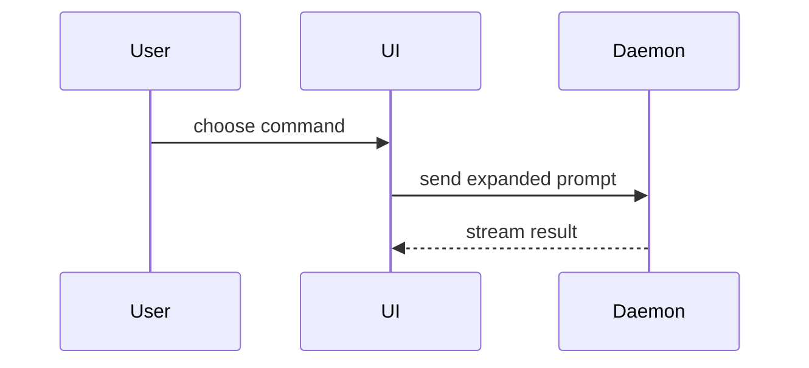

# Show-me — explain the current topic visually

Help the user understand the current topic of conversation visually. Skip the
preamble and keep prose brief. Pick the smallest view that makes the key point
clear — the answer IS the sketch, with a sentence or two around it, not an
essay with a sketch attached.

(Adapted from HumanLayer's show-me skill, owner decision 2026-08-18. Everything
below is plain markdown and works identically on Claude Code and Droid; only
the final HTML-artifact option is harness-gated.)

- Show logic or an algorithm as pseudocode:

```text
on(save)
  if content is unchanged
    return cached result
  write new content
  return fresh result
```

- Show runtime control flow as a call tree:

```text
submitForm
  createSession
    persistPrompt
    launchAgent
  navigateToSession
```

- Show UI structure as a component tree, including state and module boundaries
  that matter:

```tsx
<SessionPage> (apps/example/src/routes/session.tsx)
  useSessionEvents()
  <SessionToolbar>
    <RunSkillButton> (packages/ui)
```

- Show file responsibility or a broad refactor as a shallow file tree:

```text
src/
|-- commands/       # parses user actions
|-- sessions/       # owns session state
`-- transport/      # sends API requests
```

- Show component interaction, control flow, or data flow with Mermaid:



- Use `diff` when the point is what changes and the surrounding shape already
  exists. Match the diff shape to the topic.

For a component change:

```diff
 <SessionPage>
   useSessionEvents()
   <SessionToolbar>
+    <RunSkillButton />
   <SessionTimeline>
+    <SkillResultCard />
```

For a file-layout change:

```diff
 src/
 |-- commands/
+|   `-- show-me.ts       # expands the slash command
 |-- sessions/
-`-- transport.ts
+`-- transport/
+    |-- client.ts
+    `-- stream.ts
```

For a call-tree or call-stack change:

```diff
 submitForm
   createSession
     persistPrompt
+    expandSkillMention
     launchAgent
-  navigateToSession
+  navigateToSession
+    subscribeToEvents
```

For a state or control-flow change:

```diff
 on(save)
-  write content
+  if content is unchanged
+    return cached result
+  write new content
+  invalidate cache
```

- Show the whole block when most of it is new, when omitted context would hide
  ownership or order, or when the user needs a copyable target shape:

```ts
function expandSkill(command: string): string {
  const skillName = command.slice(1)
  return `use the ${skillName} skill`
}
```

- For a visual UI, layout, state comparison, or concept too dense for Mermaid,
  AND only when the session's tools include the Artifact tool (Claude Code
  ≥2.1.183 with a claude.ai login — the same gate ideate uses): publish ONE
  focused HTML page via the Artifact tool, following its required design-skill
  step. Match the product's colors, type, spacing, and components; use real
  labels and data; support desktop and mobile; give the user the link. Where
  the tool is absent (Droid, headless, disabled), stay in markdown — a Mermaid
  block or tree in chat is the fallback, never a written HTML file.

- Place each visual next to the short text it supports. Keep only the calls,
  files, props, states, and boundaries needed to answer the user's current
  question.

## Boundaries

Read-only: this skill explains, it never edits code, files, or the goal queue.
Charts of numeric data (trends, distributions, dashboards) are a dataviz job,
not this skill's.
